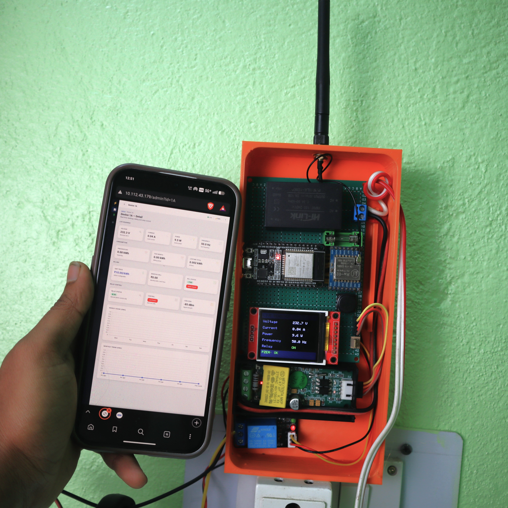
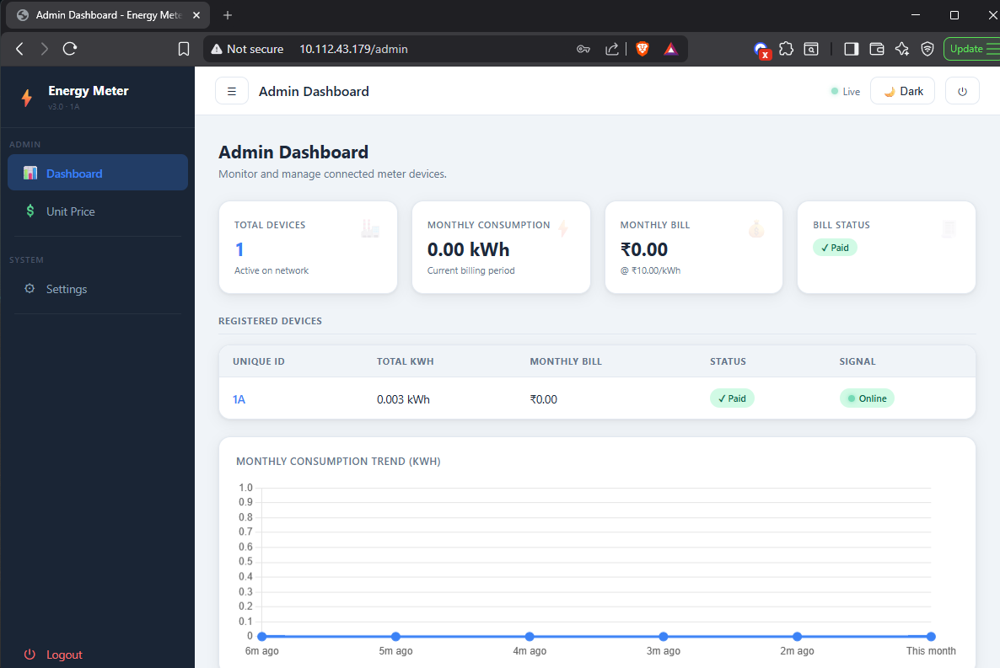
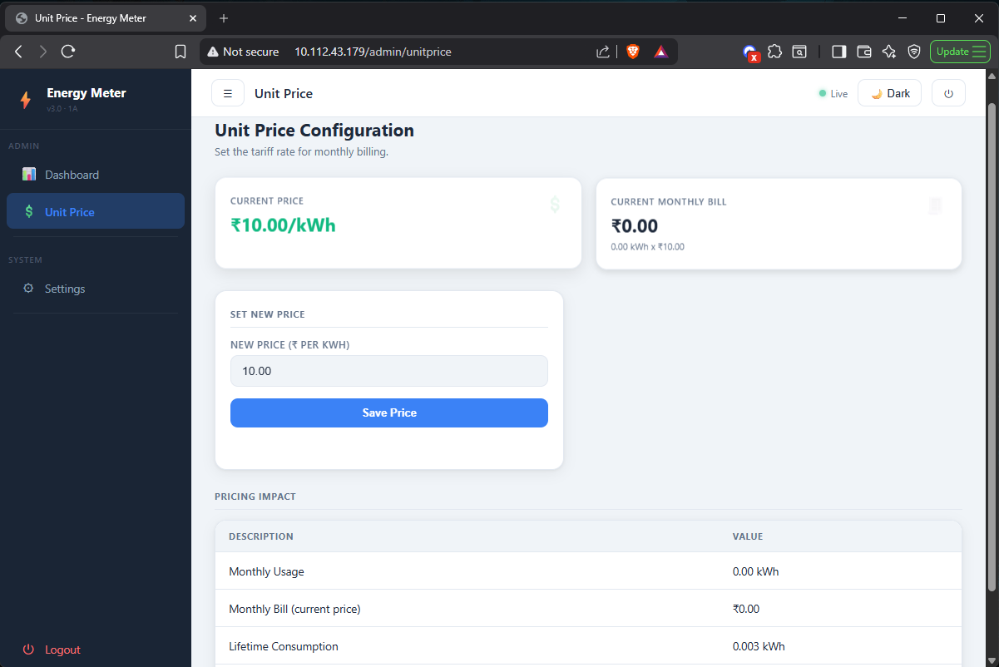
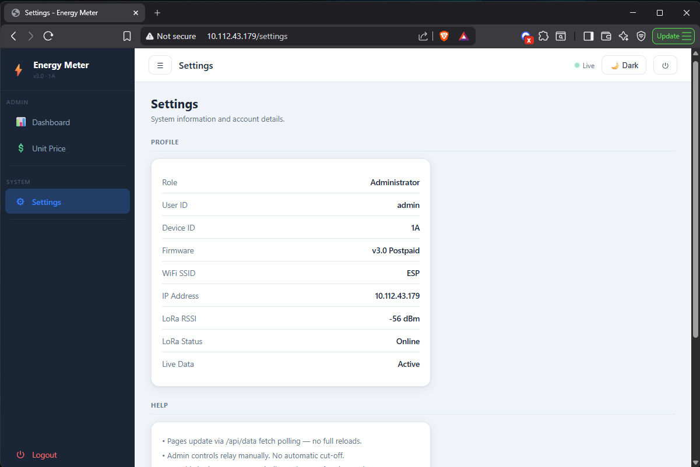
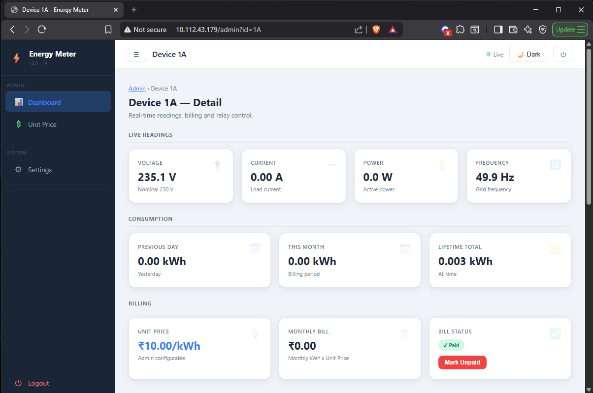
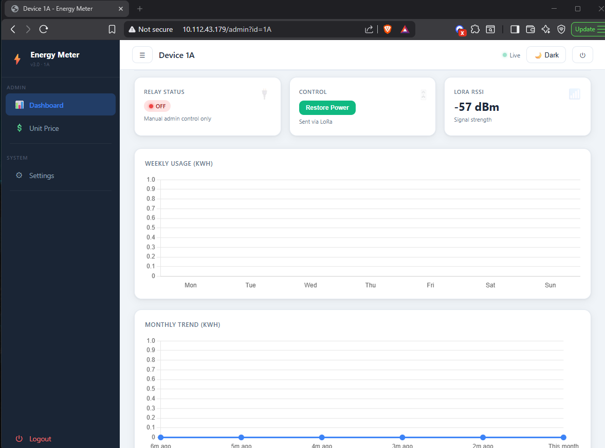

# LoRa Smart Energy Meter.

A LoRa-based smart prepaid energy meter built using **ESP32**. The system measures real-time electrical parameters using the **PZEM-004T** energy meter module and transmits the data wirelessly through a **LoRa (SX1278)** module. Readings are displayed locally on a TFT screen and remotely through a web dashboard.

---

## 📷 Project Gallery

### Full System Working


### Field Testing


### Web Dashboard – Login


### Dashboard Screenshots
| | | |
|---|---|---|
|  |  |  |
|  |  | |

---

## ✨ Features

- ⚡ Real-time monitoring of **voltage, current, power, frequency, and energy**
- 📡 **LoRa-based** long-range wireless communication
- 🖥️ Local **TFT display** for live readings
- 🌐 Remote monitoring via **web dashboard**
- 🔌 **Relay control** from the dashboard
- 💳 Prepaid-style monitoring concept (wallet-based usage)
- 📦 Compact design with 3D printed enclosure

---

## 🔍 System Overview

The system consists of two ESP32-based nodes:

- **Transmitter Node**: Reads electrical parameters from PZEM-004T, displays them on a TFT screen, and sends data over LoRa.
- **Receiver Node**: Receives LoRa packets and serves a web dashboard over WiFi for remote monitoring and relay control.

---

## 🔌 Circuit Diagrams

### Transmitter (TX) Circuit Connections


### Receiver (RX) Circuit Connections


---

## 🛠️ Hardware Components

### Transmitter Node
| Component | Description |
|-----------|-------------|
| ESP32 | Main microcontroller |
| PZEM-004T | Energy meter module (voltage, current, power, frequency, energy) |
| SX1278 (RA-02) | LoRa radio module |
| 1.8" TFT (ST7735) | Local display |
| Relay Module (5V) | Load switching |
| Push Button | Local user input |
| HLK AC-DC Module | Power supply from mains |
| Perfboard + Wiring | Enclosure electronics |

### Receiver Node
| Component | Description |
|-----------|-------------|
| ESP32-S3 | Main microcontroller |
| SX1278 LoRa Module | Radio receiver |
| OLED Display (0.96") | Local status display |
| WiFi | Used for web dashboard |

---

## 📌 Pin Connections

### Transmitter Pinout (ESP32)

**LoRa (SPI)**
| Signal | GPIO |
|--------|------|
| SCK    | 18   |
| MISO   | 19   |
| MOSI   | 23   |
| NSS    | 5    |
| RST    | 14   |
| DIO0   | 26   |

**TFT Display (ST7735)**
| Signal | GPIO |
|--------|------|
| CS     | 5    |
| DC     | 21   |
| RST    | 22   |
| MOSI   | 23   |
| SCK    | 18   |

**PZEM-004T (UART)**
| Signal | GPIO |
|--------|------|
| TX     | RX2 (16) |
| RX     | TX2 (17) |

**Other**
| Component    | GPIO |
|--------------|------|
| Relay        | 2    |
| Push Button  | 4    |

---

### Receiver Pinout (ESP32-S3)

**LoRa (SPI)**
| Signal | GPIO |
|--------|------|
| SCK    | 12   |
| MISO   | 11   |
| MOSI   | 10   |
| NSS    | 15   |
| RST    | 14   |
| DIO0   | 13   |

**OLED Display (I2C)**
| Signal | GPIO |
|--------|------|
| SDA    | 17   |
| SCL    | 18   |

---

## 📁 Folder Structure

```
lora-smart-energy-meter/
│
├── Transmitter/
│   └── transmitter_code.ino
│
├── Receiver/
│   └── receiver_code.ino
│
├── diagrams/
│   ├── TX circuit connections.png
│   └── RX circuit connections.png
│
├── Images/
│   ├── Working.JPG
│   ├── Field Testing.JPG
│   ├── login 1.png
│   ├── 2.png
│   ├── 3.png
│   ├── 4.png
│   ├── 5.png
│   └── 6.png
│
└── README.md
```

---

## ⚙️ How It Works

1. The **transmitter** reads electrical values (voltage, current, power, frequency, energy) from the PZEM-004T module.
2. Readings are displayed in real-time on the local TFT screen.
3. Data is packaged and transmitted wirelessly via **LoRa** radio.
4. The **receiver** captures incoming LoRa packets.
5. Received data is pushed to a **web dashboard** hosted on the ESP32-S3 over WiFi.
6. Users can monitor live energy usage and **control the relay remotely** through the dashboard.

---

## 📦 Libraries Used

- [LoRa by sandeepmistry](https://github.com/sandeepmistry/arduino-LoRa)
- [PZEM-004T v3.0 by mandulaj](https://github.com/mandulaj/PZEM-004T-v30)
- [TFT_eSPI by Bodmer](https://github.com/Bodmer/TFT_eSPI)
- [Adafruit SSD1306](https://github.com/adafruit/Adafruit_SSD1306)
- [ESPAsyncWebServer](https://github.com/me-no-dev/ESPAsyncWebServer)

---

## 🚀 Getting Started

1. Clone this repository.
2. Open `Transmitter/transmitter_code.ino` in Arduino IDE and flash to the transmitter ESP32.
3. Open `Receiver/receiver_code.ino` in Arduino IDE and flash to the receiver ESP32-S3.
4. Power both nodes. The transmitter will begin sending readings; the receiver will host the web dashboard.
5. Connect to the receiver's WiFi network and open the dashboard URL shown on the OLED display.

---

## 📄 License

This project is open-source. Feel free to use, modify, and share it for educational and personal use.
